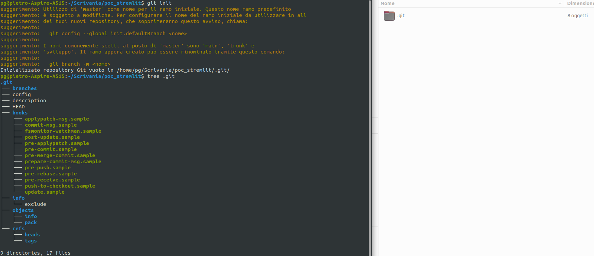
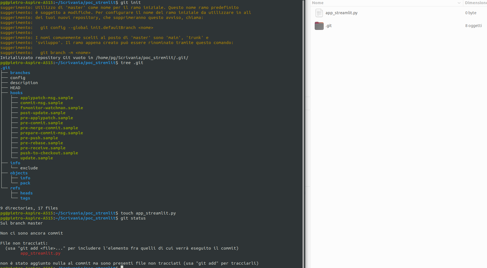
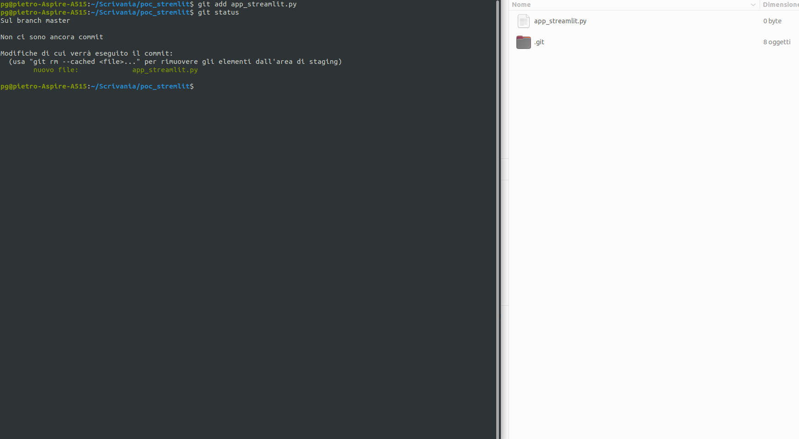
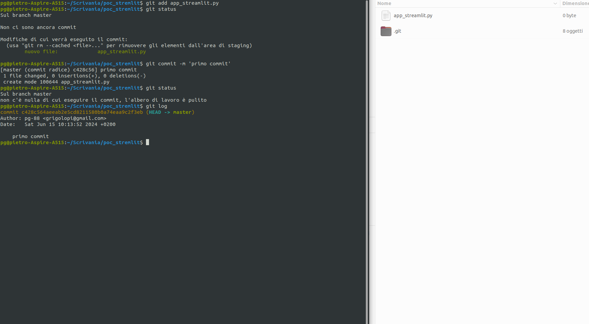
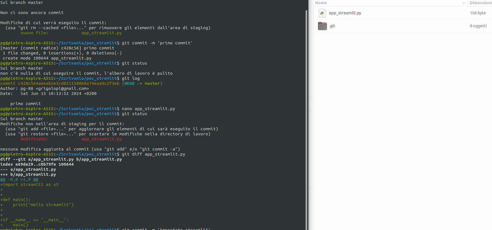
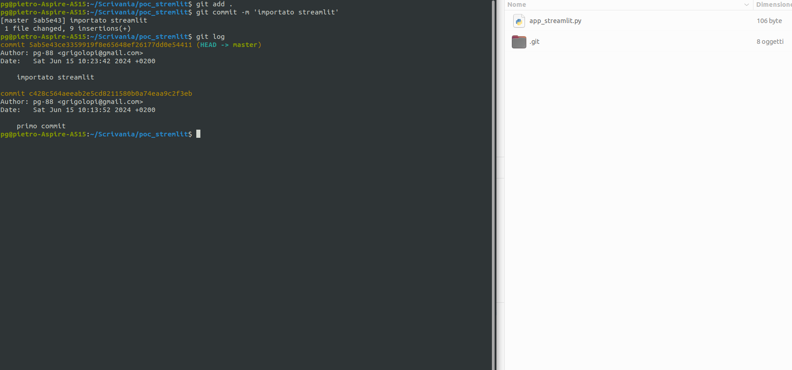
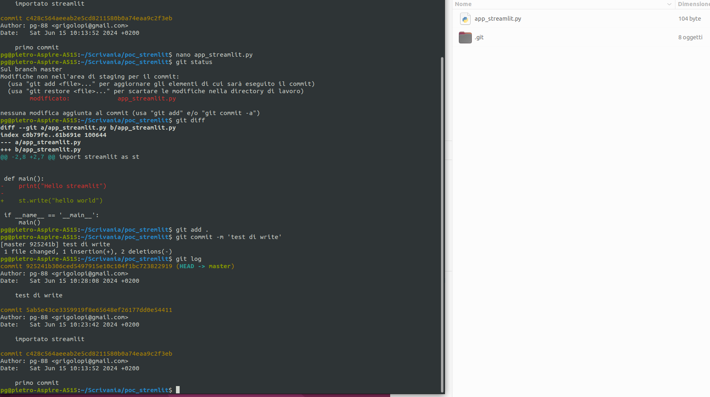
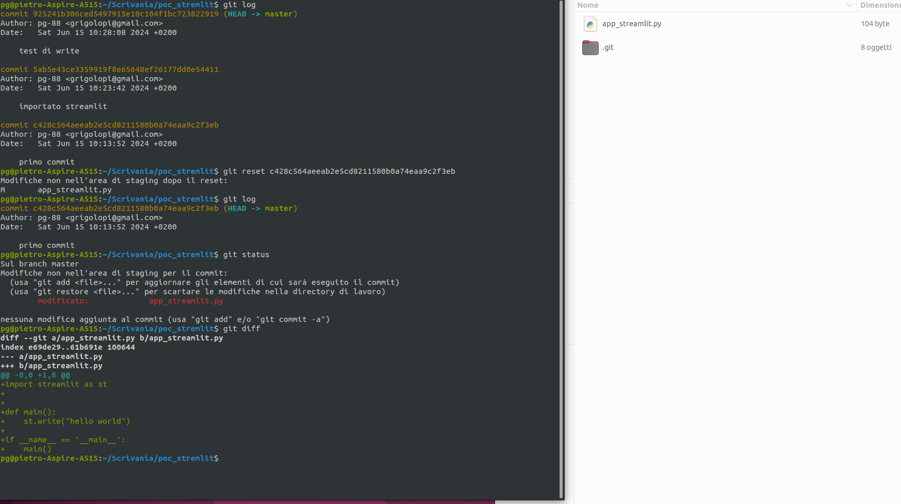
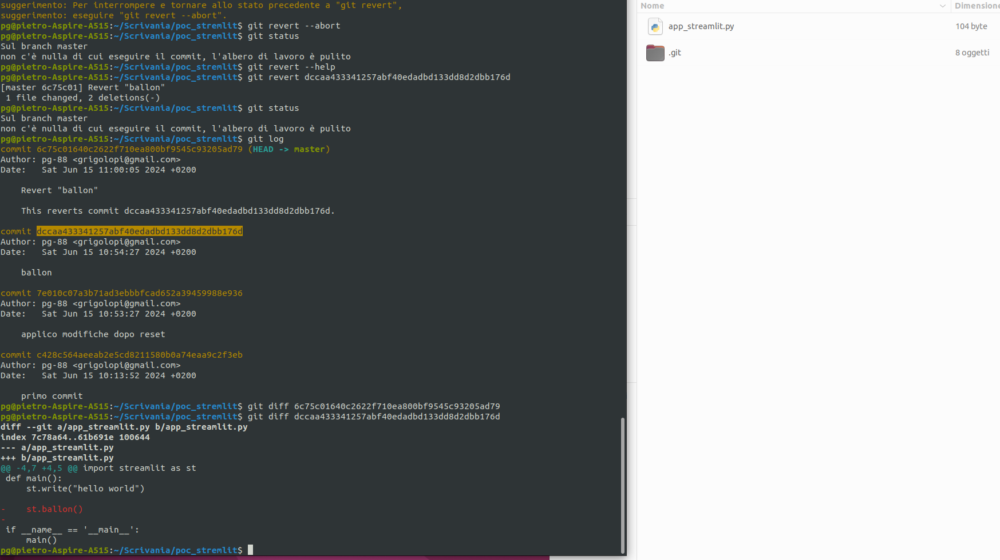

# Git - Version Control

Si tratta di un programma che funziona a riga di comando, che permette di gesire i file e le modifiche che vengono fatte su di essi

Esistono diversi strumenti che sfruttano la potenzialità di git per offrire servizi di condivisione in cloud, interfacce più familiari per poter sfruttare al massimo le funzionalità.

Noi abbiamo usato gitHub che è un cloud di microsoft che permette di utilizzare git online

Per installare git sul proprio sistema: [sito ufficiale](https://git-scm.com/downloads)
Perché si chiama così? [Articolo in inglese su dev.to](https://dev.to/moeenmahmud/how-git-got-its-name-2g36)

## Lavorando con git in locale

Senza introdurre, per ora, la complessità di una repository remota da sincronizzare, vediamo gli step e gli elementi di base di git.

### Repository 

- La cartella che contiene i file di cui osservare i cambiamenti. Per creare una repository nella cartella in cui stiamo lavorando bisogna invocare il comando:

`git init`

Questo farà si che ogni modifica a file contenuti in questa cartella (e sotto cartelle) venga tracciata da git.

- In realtà il tracciamento non è automatico, bisogna dire a git cosa aggiungere, si fa con il comando:

`git add <nome file>`

Oppure se vogliamo tracciare tutto 

`git add . `

- Una volta aggiunti i file desiderati possiamo creare un **commit**. Un commit è un blocco di modifiche che vogliamo vengano recepite dalla repository andando quindi a modificare i file nelle cartelle. 
Il comando è 

`git commit -m <commento obbligatorio>`

- Possiamo vedere lo stato della repository, quindi se c'è qualche modifica non ancora entrata a far parte della repository (cioè di cui non è ancora stato fatto il commit), se c'è qualche file non tracciato (ovvero non ancora aggiunto) con il comando status:

`git status`

- mentre se vogliamo avere il quadro completo dell'evoluzione della repository, c'è il comando log:

`git log`

mostra tutti i commit che sono entrati a far parte della repo in ordine dal più recente al meno recente.

`git log --all --decorate --oneline --graph` 

ovvero git a dog è lo stesso comando ma con questi flag genera un output più chiaro, utile soprattuto per repo in cui lavorano più persone e/o sono stati fatti diversi rami e magari poi uniti nel corso dell'evoluzione del progetto. In sostanza si usa per progetti complessi altrimenti va benissimo git log.

- quando le cose vanno male si può tornare a un commit funzionante. In realtà questo si può fare in due modi:
  - `git reset` modifica il log passati e cambia la repository per tornare a un commit precedente 
  - `git revert` torna a un commit precedente senza modificare la storia della repository (ovvero il log)

### Esempio

Come test per vedere quanto detto finora creo una cartella poc_streamlit che mi servirà per produrre una pagina di test con streamlit.

1) mi sposto nella cartella che voglio far diventare la mia repository e **inizializzo git**

sono stati creati i file e le cartelle che servono a git 

2) inizio a creare i file, quindi con `git status` vedo dei file non tracciati.

3) aggiungo i file con `git add` e vedo che l'output di status è cambiato

4) commit per inserire nella repository le modifiche appena fatte
 la repository adesso è aggiornata quindi lo status mi dice che "l'albero è pulito" non ho file modificati da inserire nella repo. Ora dal log vedo il mio commit, ogni commit ha un **autore** (rappresentato da nome utente e mail), una data in cui è stato fatto, un commento per descrivere brevemente di cosa si tratta e un **codice alfanumerico univoco**.

5) modifico il file e invoco `git diff` per vedere le modifiche al file

6) add e commit delle modifiche   
7) ritorno al commit precedente con reset
 reset può creare problemi di sincronizzazione della repository se si lavora in gruppo quindi ci sono più utenti che modificano i file dello stesso progetto, e, soprattutto, può creare problemi se si lavora con una repository in cloud (come gitHub)
8) ritorno al commit precedente con revert
 revert ritorna al commit precedente generando un nuovo commit che di fatto riporta la repository alla condizione precedente all'ultimo commit. Quindi la storia precedente non viene modificata ma viene semplicemente creato un nuovo commit. Per tornare a un commit che non è l'ultimo, con revert si possono generare conflitti sui file da risolvere con il merge.

### GitHub

Per utilizzare [github](https://github.com/) per prima cosa è necessario creare un'account.

Una volta creato l'account, consiglio di seguire la procedura di creazione della repository fornita dal sito. Una volta dato il nome, la descrizione e il file README, gitHub ci fornisce le istruzioni per clonare la repository in locale.
Il comando è:

`git clone <url della repo fornito da github>`

Ovvero creare una repository sul nostro pc uguale a quella in cloud che possiamo modificare. Per modificare la repository, la procedura di add, commit rimane la stessa, in più per sincronizzare quello che sta in cloud è necessario dare il comando `git push` che manda le modifiche alla repository `origin` in cloud

**N.B.:** è probabile che sorga un errore nella sincronizzazione tramite push (o sync) dovuto al fatto che potremmo non aver definito le credenziali dell'utente git, per risolvere questo occore dare 2 comandi: 

`git config --global user.name <nome utente>`
`git config --global user.email <e-mail>`

queste credenziali sono quelle che vengono mostrate nel log e non devono per forza essere quelle usate per la registrazione su github, anche se è consigliabile che coincidano.

## Come proseguire da qui

- video tutorial [basi di git (ITA)](https://youtu.be/wPAE9-DdMtI?si=fk8wGsnORmoaLRiL), [git e github (EN)](https://youtu.be/RGOj5yH7evk?si=mIG705TuA5p1iX04)
- [i branch o rami sono una funzionalità molto importante di git che permette di seguire diversi filoni di sviluppo contemporaneamente](https://www.freecodecamp.org/news/git-branching-commands-explained/)
- [da github un meccanismo molto utilizzato per collaborare a repository pubbliche è il sistema del fork ](https://www.freecodecamp.org/news/git-and-github-workflow-for-open-source/)
